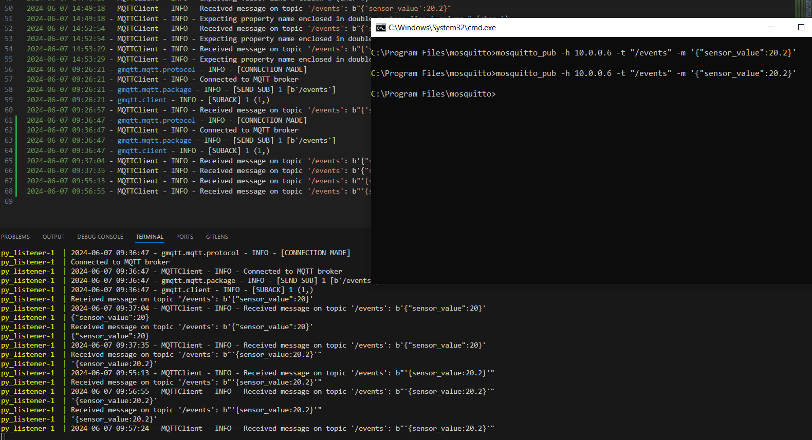

# MQTT Docker Example

This project demonstrates how to set up a Mosquitto MQTT broker and a Python application that listens for messages on the `/events` topic. The project uses Docker and Docker Compose to manage the services, and the Python application leverages the `gmqtt` library for asynchronous MQTT communication.

## Setup

### 1. Install Docker

Follow the installation instructions for Docker from the official [Docker documentation](https://docs.docker.com/desktop/install/windows-install/).

### 2. Build and Run Docker Container for MQTT

Navigate to the project directory and run the following commands:

```bash

    docker-compose up --build

```

### 3.Publising to that topic
```bash

    mosquitto_pub -h localhost -t "/events" -m '{"sensor_value":20.2}'


```
# Output
## Publishing from Windows



## Publishing from Raspberry Pi

